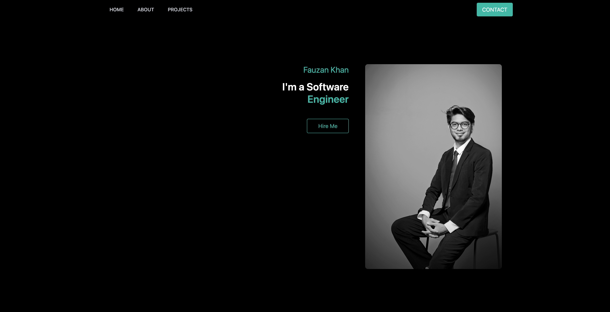
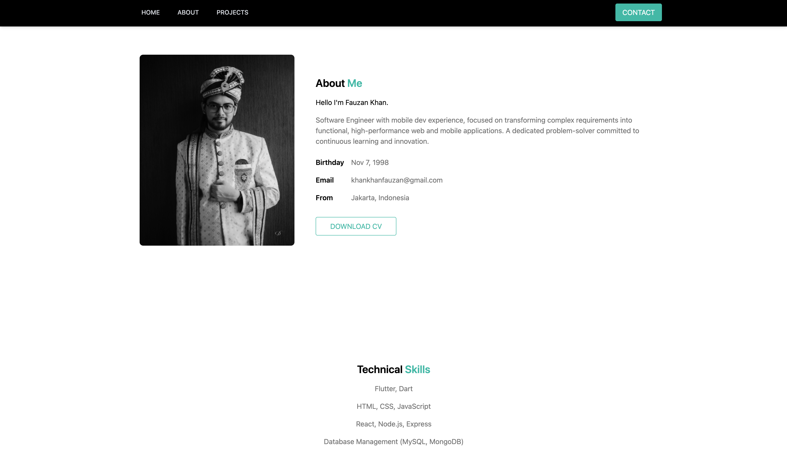
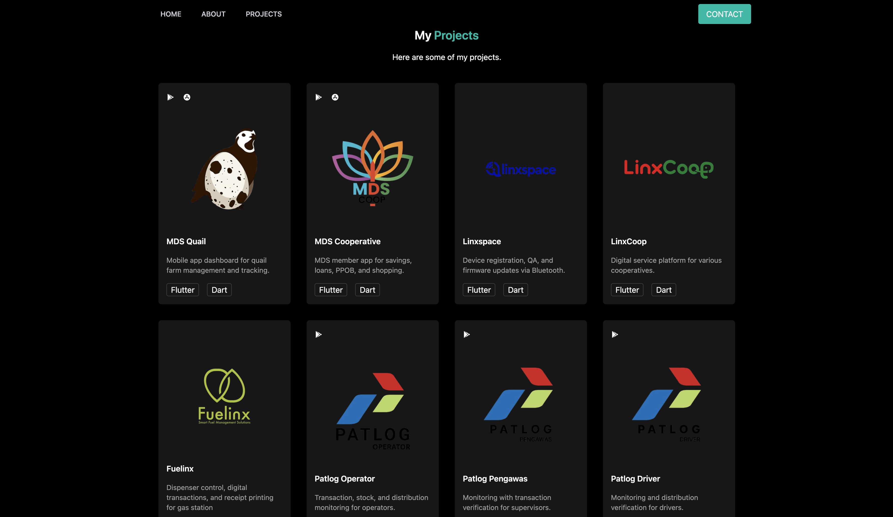
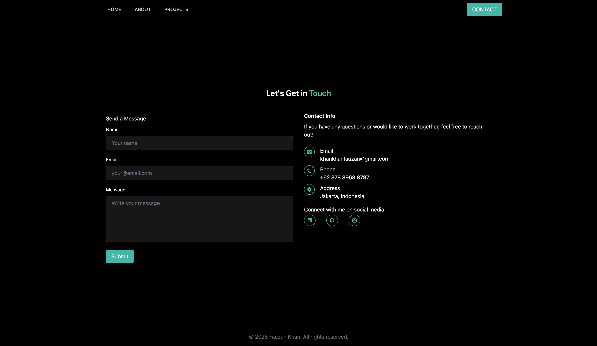
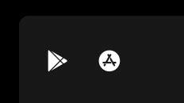
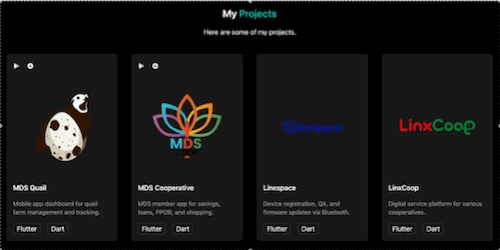

[](https://classroom.github.com/a/KTVBmApB)

---

# RevoU Student Portfolio

## Overview

This website shows my learning progress and small projects as a RevoU student. It is a simple personal site with sections for Home, About, Projects, and Contact.


## UI Overview

-   Screenshots: overview of each section on the page
    -   Home: 
    -   About & Skills: 
    -   Projects: 
    -   Contact: 

## Features

-   Basic navigation between sections (Home, About, Projects, Contact)
-   Consistent theme (black + teal) and simple layout
-   Projects grid with images, titles, short descriptions, and tech list
-   Contact info with email, phone, address and social links
-   Contact form with native validation (required fields and email type)
-   Download CV button
-   Responsive design (mobile-first with Tailwind)
-   Fixed top navbar (remains visible when scrolling)
-   Hover transition on buttons, links, and projects cards

## Technologies

-   HTML5
-   ~~CSS3~~ Tailwind v4.1
-   Google Fonts (`Poppins`)
-   ~~Font Awesome icons v4.7.0~~ Remix Icon v4.7.0
    _some icons is not available in Font Awesome Icons_

## New Updates

This section summarizes the main changes from the previous version:

-   Styling migration to Tailwind (utility-first)
-   Added responsiveness for mobile, tablet, and desktop
-   Fixed navbar to remain visible while scrolling
-   Hover transition for smoother interactions

## Components (Tailwind)

-   Primary Button

    -   Preview: 
    -   Snippet:
        ```html
        <button
            class="text-white bg-teal-500 transition hover:bg-teal-700 hover:cursor-pointer px-4 py-2 rounded"
        >
            CONTACT
        </button>
        ```

-   Secondary Button

    -   Preview: 
    -   Snippet:
        ```html
        <button
            class="py-2 px-8 border-teal-500 text-teal-500 border-1 rounded  transition hover:border-teal-700 hover:text-teal-700 hover:cursor-pointer"
        >
            HireMe
        </button>
        ```

-   Icon Buttons (Remix Icon)

    -   Preview: 
    -   Snippet:
        ```html
        <a
            href="https://play.google.com/store/apps/details?id=com.elefante.mds_partner&pcampaignid=web_share"
            target="_blank"
            rel="noopener noreferrer"
            class="ri-google-play-fill transition hover:text-teal-500 hover:cursor-pointer"
        ></a>
        ```

-   Cards Hover Transition

    -   Preview: 
    -   Snippet:
        ```html
        <div
            class="bg-neutral-900 rounded-md p-4 shadow-lg transition hover:-translate-y-2 flex flex-col h-full"
        >
            <!-- card content -->
        </div>
        ```

-   Fixed Navbar

    -   Snippet:
        ```html
        <nav
            class="fixed inset-x-0 top-0 z-50 bg-black shadow-md after:pointer-events-none after:absolute after:inset-x-0 after:bottom-0 after:h-px"
        >
            <!-- nav content -->
        </nav>
        ```

-   Responsive Grid

    -   Snippet:
        ```html
        <div
            class="grid sm:grid-cols-2 md:grid-cols-3 lg:grid-cols-4 gap-8 mt-8"
        >
            <!-- cards -->
        </div>
        ```

-   Form Inputs (Focus States)
    -   Snippet:
        ```html
        <input
            class="py-2 px-4 border-1 bg-neutral-900 border-neutral-700 rounded-md w-full mt-2 mb-4 text-white placeholder:text-gray-500 transition focus-within:outline-2 focus-within:-outline-offset-2 focus-within:outline-teal-500"
        />
        ```

## Deployed Page

-   GitHub Page: [Open](https://revou-fsse-oct25.github.io/milestone-1-khankhanfauzan/)

## How to Deploy (GitHub Pages)

1. Push this project to GitHub (main branch)
2. Open repository `Settings` → `Pages`
3. Under `Source`, choose `Deploy from a branch`
4. Set `Branch` to `main` and `Folder` to `/root` (or `/docs` if you use docs folder)
5. Click `Save`
6. Wait 1–2 minutes, your page will be live
7. The site uses `index.html` at the project root

## Project Structure (minimal)

```
.
├── README.md
├── assets/
│   └── cv_fauzan.pdf
├── css/
│   └── styles.css
├── images/
│   ├── profiles/
│   │   ├── fauzan_photo.JPG
│   │   └── fauzan_photo_2.JPG
│   ├── projects/
│   │   ├── mds_quail.png
│   │   ├── mds_coop.png
│   │   ├── linxspace.png
│   │   ├── linxcoop.png
│   │   ├── fuelinx.png
│   │   ├── patlog_operator.png
│   │   ├── patlog_pengawas.png
│   │   ├── patlog_driver.png
│   │   ├── mypertashop.png
│   │   ├── manager_mypertashop.png
│   │   └── mitra_pertashop.png
│   ├── gifs/
│   │   ├── cards_transition.gif
│   │   ├── primary_button_transition.gif
│   │   ├── secondary_button_transition.gif
│   │   ├── primary_icon_transition.gif
│   │   ├── secondary_icon_transition.gif
│   │   └── website_overview.gif
│   └── screenshots/
│       ├── home_section.png
│       ├── about_and_skills_section.png
│       ├── projects_section.png
│       └── contact_section.png
└── index.html
```

## Access Locally (optional)

-   Open `index.html` directly in your browser, or run a small server:
-   macOS/Linux: `python3 -m http.server 8000` then visit `http://localhost:8000/`
-   Open `index.html` on code editor, and simply run with **Live Server**
-   Optional (if using Tailwind CLI): run the build process during development

```bash
npx @tailwindcss/cli -i ./input.css -o ./css/styles.css --watch
```

### See the difference from previous build

-   `main` = latest version (Tailwind, responsive, fixed navbar, hover animation)
-   `module-1` = previous version (Manual CSS)
-   Open terminal in code editor, then run this command:

```bash
git checkout module-1
```

-   Then follow the steps on [Access Locally](#access-locally-optional)
-   Optional: compare core file changes (HTML/CSS) with diff command:

```bash
git diff module-1..main -- index.html css/styles.css
```
